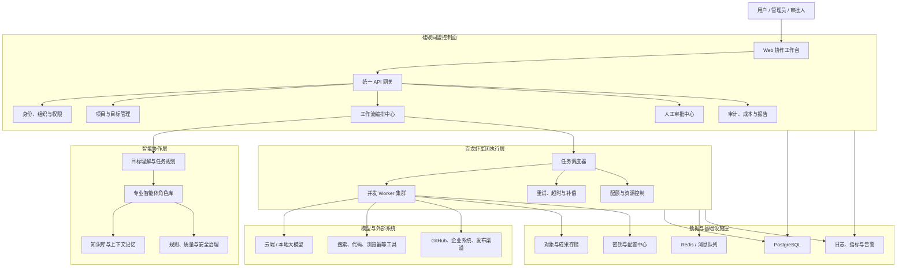
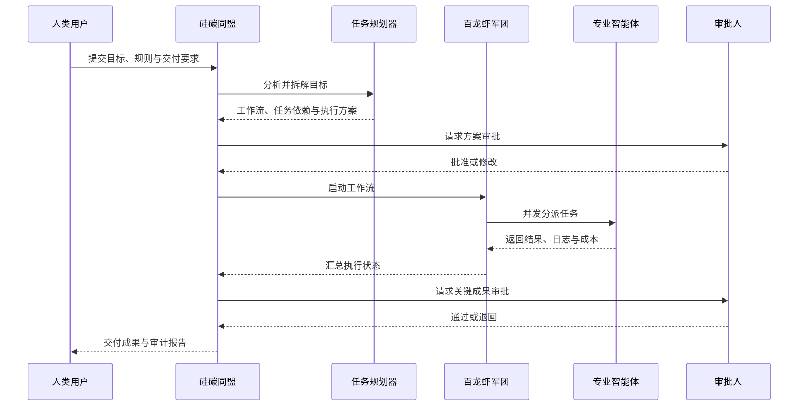
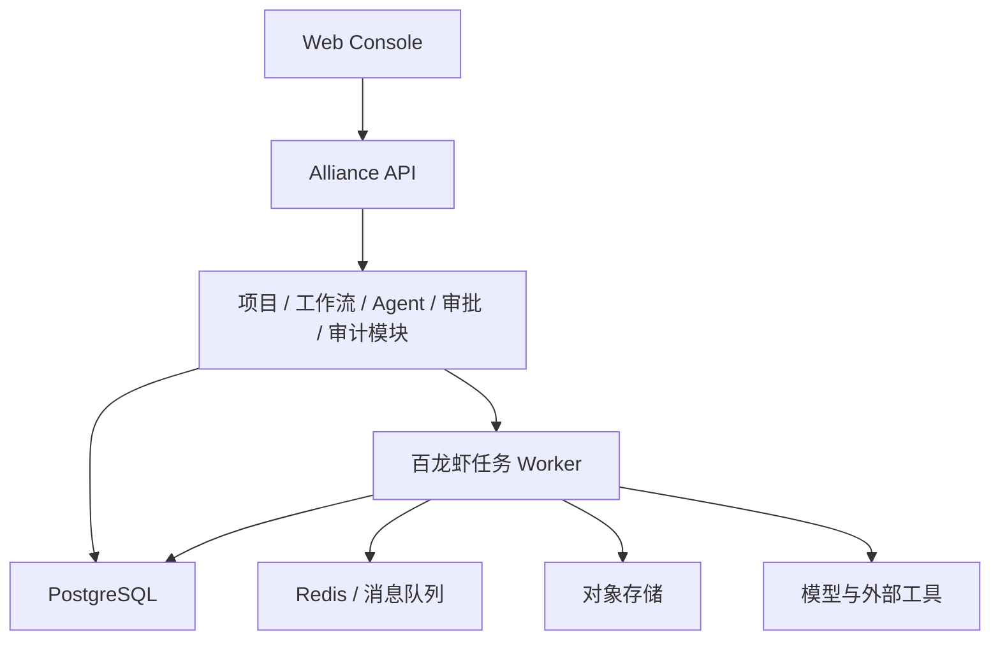

# 硅碳同盟总体架构方案（审核稿）

> 文档状态：管理层审核  
> 文档版本：v0.1  
> 更新日期：2026-06-06

## 1. 产品定位

**硅碳同盟（Carbon-Silicon Alliance）**是连接人类决策与 AI 智能体执行的协作操作系统。

用户提出目标、规则和约束，平台负责组织多个专业智能体完成任务，并通过人工审批、权限控制、过程审计和成果归档，保证执行过程可控、可查、可复用。

> 人类负责目标与关键决策，AI 负责拆解、协作与执行。

品牌与技术边界：

| 名称 | 定位 |
|------|------|
| 硅碳同盟 | 总产品、总品牌与协作操作系统 |
| 十二层架构 | 产品能力与治理模型 |
| 百龙虾军团 | 多智能体任务调度与并发执行引擎 |
| XIAN | 智能体、应用或业务角色体系 |
| Axium | 底层能力升级与基础设施演进方向 |
| P1/P2/P3/P4 | 产品建设与成熟阶段 |

## 2. 总体架构

可直接打开、截图或下载 PNG 的独立版本：
[`assets/silicon-carbon-alliance-overall-architecture.html`](./assets/silicon-carbon-alliance-overall-architecture.html)



## 3. 核心组成

### 3.1 硅碳同盟控制面

控制面是平台的管理入口和业务中枢，负责：

- 用户、组织、角色和权限；
- 项目、目标与任务管理；
- 工作流定义和运行控制；
- 人工审批、退回、暂停与终止；
- 成本、日志、成果和审计报告。

### 3.2 智能协作层

智能协作层负责将人的目标转化为 AI 可执行任务：

- 理解目标、约束和交付标准；
- 拆解任务并生成依赖关系；
- 选择合适的智能体、模型和工具；
- 管理上下文、知识库与长期记忆；
- 执行质量、安全和合规检查；
- 汇总多个智能体的执行结果。

### 3.3 百龙虾军团执行层

百龙虾军团是硅碳同盟的任务执行引擎，负责：

- 并发任务调度；
- Worker 生命周期和负载控制；
- 超时、取消、失败重试与补偿；
- 任务优先级和资源配额；
- 执行状态与事件上报；
- 后续多节点和分布式执行。

建议技术分工：

- Python：控制面、工作流、模型调用和业务集成；
- Rust：高并发调度、Worker 管理和资源控制。

### 3.4 数据与基础设施层

| 组件 | 主要职责 |
|------|----------|
| PostgreSQL | 项目、任务、权限、审批和审计记录 |
| Redis / 消息队列 | 任务分发、事件通知和临时状态 |
| 对象存储 | 文档、代码包、报告和其他交付成果 |
| 可观测系统 | 日志、指标、调用链和告警 |
| 密钥中心 | 模型密钥和第三方系统凭证 |

### 3.5 外部能力接入层

平台采用适配器设计，避免绑定单一供应商：

- 云端与本地大模型；
- 搜索、浏览器、代码执行和文档处理工具；
- GitHub、GitLab、企业微信、钉钉等业务系统；
- 企业内部数据库、知识库和审批系统。

## 4. 核心业务流程



核心原则是在人类控制下形成完整闭环：

```text
目标输入 -> 任务规划 -> 方案审批 -> 并发执行
        -> 质量检查 -> 成果审批 -> 交付归档
```

## 5. 十二层能力映射

| 层级 | 平台能力 |
|------|----------|
| L1 规则铁律层 | 规则、质量与合规检查 |
| L2 安全权限层 | 身份、授权、密钥与数据隔离 |
| L3 数据自治层 | 数据生命周期、备份与归档 |
| L4 发布调度层 | 工作流、队列、重试与分发 |
| L5 集群超维层 | Worker 集群、负载均衡与弹性 |
| L6 时序自愈层 | 监控、故障诊断与自动恢复 |
| L7 加密组网层 | 节点认证和安全通信 |
| L8 确权永生层 | 成果哈希、审计与可信存证 |
| L9 商业生态层 | 插件、模型和行业解决方案 |
| L10 运营闭环层 | 告警、工单、反馈与运营分析 |
| L11 可视化交付层 | Web 工作台、报告与私有部署 |
| L12 超维意识自治层 | 目标规划、动态编排和策略优化 |

十二层是能力治理模型，不等同于十二套独立系统或十二个微服务。

## 6. 部署架构

首版采用模块化单体，避免过早微服务化：



规模增长后，再拆分为：

- 控制面服务；
- 工作流与调度服务；
- Worker 集群；
- Agent Runtime；
- 审计与报告服务；
- 模型和工具网关。

支持三种交付模式：

1. SaaS 云端服务；
2. 企业私有化部署；
3. 本地或边缘一体机部署。

## 7. 分阶段实施

### P1：可用产品

- 项目与目标管理；
- 固定工作流；
- 多智能体并行执行；
- 人工审批；
- 持久化、重试和审计；
- 基础 Web 工作台。

### P2：平台化

- 可视化工作流编辑器；
- Agent、模型和工具配置；
- 知识库与上下文管理；
- GitHub 等外部系统集成；
- 费用、质量和效率统计。

### P3：规模化

- Rust 分布式调度核心；
- 多节点 Worker 集群；
- 租户隔离和企业权限；
- 高可用、弹性伸缩和完整可观测性。

### P4：生态化

- Agent 与工具插件市场；
- 行业工作流模板；
- 开放 API 和开发者平台；
- SaaS 与私有化商业体系。

## 8. 架构原则

1. **人类最终控制**：关键操作必须支持人工审批、终止和追责。
2. **任务全程留痕**：输入、模型、工具、输出和成本均可审计。
3. **模型供应商中立**：支持云端模型与本地模型切换。
4. **安全默认开启**：最小权限、租户隔离和密钥集中管理。
5. **先完成业务闭环**：首版采用模块化单体，验证后再分布式扩展。
6. **执行层可替换**：控制面不依赖具体模型或 Worker 实现。
7. **概念与能力一致**：明确区分已实现能力、模拟能力和规划能力。

## 9. 管理层审核事项

建议本次审核重点确认：

1. 是否同意将“硅碳同盟”定义为总产品与总品牌；
2. 是否同意将“百龙虾军团”定义为多智能体执行引擎；
3. 是否同意将十二层架构定义为能力与治理模型；
4. 首个落地场景选择内容生产、研发协作还是企业流程自动化；
5. 首版优先采用 SaaS、私有化还是双模式交付；
6. 是否批准按 P1 至 P4 的路径分阶段建设。

## 10. 建议审核结论

第一阶段不以建设完整的“自主意识系统”为验收目标，而以交付一个**可靠、可控、可审计的多智能体协作平台**为目标。

硅碳同盟负责项目、工作流、审批、治理与交付；百龙虾军团负责可靠执行；十二层架构负责统一能力边界和长期演进方向。
